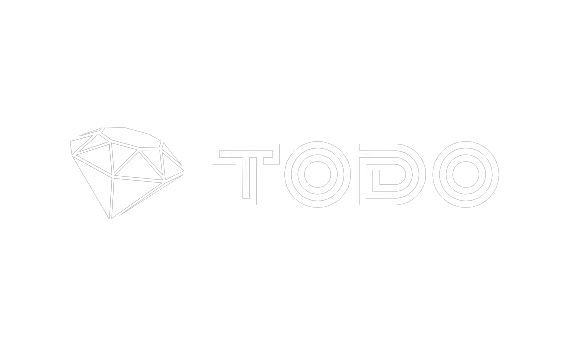

# Todo
<div>
    
</div>
## Description
A simple todo list app built with Ruby on Rails.
The purpose of this project was to learn the basics of Ruby on Rails and to get familiar with the MVC pattern and the CRUD operations.
My goal was to build a simple app that allows users to create, read, update and delete todo items.

## Tech Stack


## Installation
1. Clone this repo
```sh
git clone <repo_url>
cd rails_todo/todo_app
```
2. Install dependencies
```sh
bundle install
```
3. Run migrations
```sh
rails db:migrate
```
4. Start the server
```sh
rails s
```
5. Open your browser and go to http://localhost:3000
6. Enjoy!
